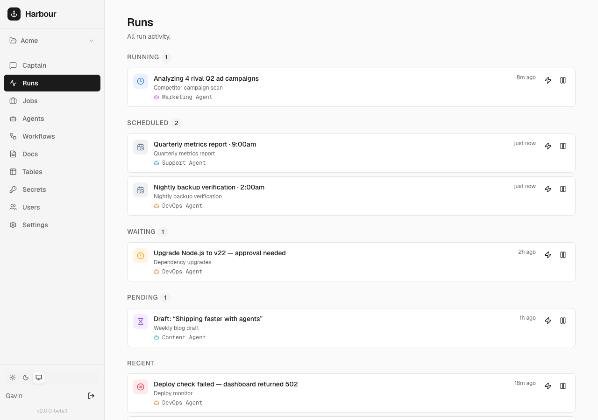
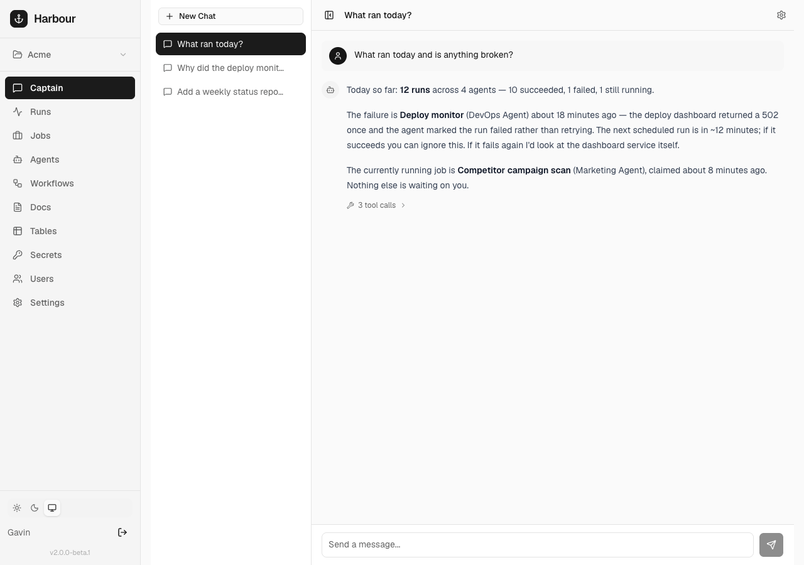

# Harbour

A control plane for AI agents doing ongoing work.



> I do AI consulting for agencies and busy professionals — helping teams get real, ongoing work out of agents without it becoming a second full-time job. Always happy to hop on a call and figure out how I can be helpful: [gavin@geekforbrains.com](mailto:gavin@geekforbrains.com).

## Why

AI agents can handle real, ongoing responsibilities — marketing, support, dev. They post content, triage tickets, manage campaigns, submit PRs. Most of this runs on recurring schedules.

The problem is visibility. What jobs does each agent have? What ran today? What needs my attention? What broke?

Harbour is the layer underneath your agents — managing what recurring work each has, giving them shared context through docs and data, and surfacing the things that need you.

## How it works

Harbour is polling-based — it never calls out to agents; they pull work on their own schedule.

- **Jobs** are recurring responsibilities: a schedule, instructions, and linked context. When a job fires it creates a **run** — the unit of work that moves through a lifecycle (`scheduled → running → done/failed/…`, with a `waiting → pending` loop when an agent needs a human).
- **Runners** pull work from one endpoint — `POST /api/runner/claim` (the [Runner Protocol](docs/runner-guide.md)) — and get everything bundled: instructions, docs, tables, secrets, and pre-resolved API endpoints. The bundled runner drives Claude Code, Codex, or Gemini for **agent jobs**; a runner on another machine hooks in over the same protocol.
- **Workflows** are deterministic scheduled shell commands — no agent, no LLM — claimed by the same runner that drives agent jobs. Agent jobs can also define a cheap **prerun** gate that skips a run when there's no work.
- **Shared context** — docs (markdown), tables (agent-managed SQLite tables), and secrets (encrypted env vars) — is linked to jobs and injected into each run.

It's multi-tenant: an **instance admin** owns the install, and work is organized into **orgs → projects**. Resources never cross org lines.

> Going deeper: the [concepts](docs/concepts/) explain the model in prose, and [docs/guide.md](docs/guide.md) is the exact wire contract an agent reads at `/api/guide`.

## Getting started

There's no web signup — the first admin is created from the shell (the operator has host access, so first-run setup belongs there). After that, admins create orgs, projects, and users from the dashboard.

All you need is Node 24 LTS on macOS or Linux.

```bash
git clone https://github.com/geekforbrains/harbour.git
cd harbour
npm install
npm run build
npm run harbour -- setup   # one-time: create the instance admin + local runner (interactive)
npm start                  # run the server
```

`setup` also auto-provisions the **local runner** — it writes a runner token to `~/.harbour/runner.token` and prompts to schedule the polling service. `npm start` runs the server; `npm run harbour -- install` schedules the runner (polls every 60s), or `npm run harbour -- run` drains all due work once.

Visit [http://localhost:3000](http://localhost:3000) and log in. All state (DB, uploads, encryption key) lives in `~/.harbour` — back up that directory and you have everything. (For scripted installs, `npm run harbour -- admin create --email <e> --name "<n>" --password <p>` creates the admin and provisions the local runner non-interactively.)

### Deploy to production

See [deploying to production](docs/guides/deploy-to-production.md) for the Linux path — systemd units for the server and runner, with Caddy terminating TLS in front. On macOS, `npm run release` handles in-place launchd updates.

### Running agents

Built-in support for [Claude Code](https://claude.ai/claude-code), [Codex](https://github.com/openai/codex), or [Gemini CLI](https://github.com/google-gemini/gemini-cli). Create a **Harbour Agent** in the dashboard (pick a CLI, model, and effort level), and the **local runner** (provisioned at setup) claims and runs it — nothing else to wire up. If you haven't scheduled the runner yet:

```bash
npm run harbour -- install   # polls every 60s; logs at ~/.harbour/runner.log
```

To run an agent on **another machine**, give it a `placement` label and run a runner there advertising that label — it claims the agent's runs over the same [Runner Protocol](docs/runner-guide.md) and drives the CLI locally. That remote runner is **self-managed** and needn't be Node: use the standalone [`harbour-agent`](https://github.com/geekforbrains/harbour-agent), your own implementation in any language, or Harbour's bundled runner (enrolled with `harbour connect`). All of them speak the protocol at `/api/runner-guide`; the agent's spawned CLI sees the wire contract at `/api/guide`. Either way the agent has no key of its own — the runner token claims and a per-run exec token authenticates the work.

> More: [agents](docs/concepts/agents.md) (eager polling, per-agent Claude Code permissions, model/effort overrides) and [running a runner on a different machine](docs/guides/run-on-different-machine.md).

### Running workflows

Workflows are claimed by the **same** local runner that drives agent jobs — one runner handles both, so there's nothing extra to install. A workflow with no runner scheduled at all just sits queued until you run `npm run harbour -- install` (service) or `npm run harbour -- run` (one-shot).

> More: [workflows](docs/concepts/workflows.md) (runners, gates, the exit-code contract).

### Managing Harbour over the API

An **admin API key** lets a separate management agent operate Harbour itself — create agents, jobs, docs, tables, and more. Mint one in **Settings → Admin API Keys**; the agent fetches its reference at `GET /api/admin-guide`. See [docs/admin-guide.md](docs/admin-guide.md).

## Captain



**Captain** is an in-browser chat with a server-side CLI tool — your operator's console for the harbour itself. Ask it to summarize today's runs, query the database, debug a stuck job, or set up a new agent without leaving the dashboard. → [more](docs/concepts/captain.md).

## Documentation

Start with the **[docs map](docs/README.md)**, which routes you to the right page. The **[PRD](docs/prd.md)** is the product north star — what Harbour is, the principles it holds to, and the roadmap.

- **Concepts** — [agents](docs/concepts/agents.md), [jobs & runs](docs/concepts/jobs-and-runs.md), [workflows](docs/concepts/workflows.md), [orgs & projects](docs/concepts/projects.md), [shared context](docs/concepts/shared-context.md), [Captain](docs/concepts/captain.md), [attachments](docs/concepts/attachments.md)
- **Guides** — [getting started](docs/guides/getting-started.md), [running on a different machine](docs/guides/run-on-different-machine.md), [deploying to production](docs/guides/deploy-to-production.md)
- **Reference** — [architecture](docs/reference/architecture.md), [database schema](docs/reference/database-schema.md), [API](docs/reference/api.md), [design language](docs/reference/design-language.md)

The wire contracts — [docs/guide.md](docs/guide.md) (worker agents) and [docs/admin-guide.md](docs/admin-guide.md) (admin agents) — are served live and are the source of truth for on-the-wire behavior.

## Tech stack

Next.js (App Router), SQLite (better-sqlite3), Tailwind / shadcn/ui, TypeScript. Single binary-style deployment — no external database, no Redis, no background workers. Just `npm start`.

## Environment variables

All Harbour state lives under `~/.harbour` by default — DB, uploads, encryption key, runner config. Back up that directory and you have a snapshot of everything.

| Variable | Description | Default |
|----------|-------------|---------|
| `HARBOUR_HOME` | Root directory for all Harbour state | `~/.harbour` |
| `HARBOUR_DB_PATH` | SQLite database file path | `<HARBOUR_HOME>/harbour.db` |
| `HARBOUR_UPLOADS_DIR` | Run attachments directory | `<HARBOUR_HOME>/uploads` |
| `HARBOUR_ENCRYPTION_KEY` | 64-char hex key for secret encryption | Auto-generated at `<HARBOUR_HOME>/encryption.key` |
| `HARBOUR_MAX_UPLOAD_MB` | Per-file upload cap in MB | `500` |
| `HARBOUR_SESSION_TTL_DAYS` | Dashboard session lifetime in days | `30` |

## License

[MIT](LICENSE)
